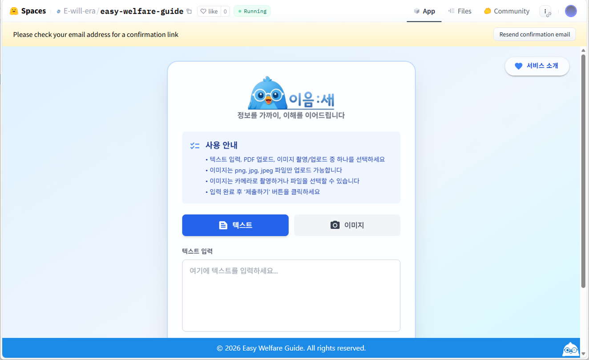
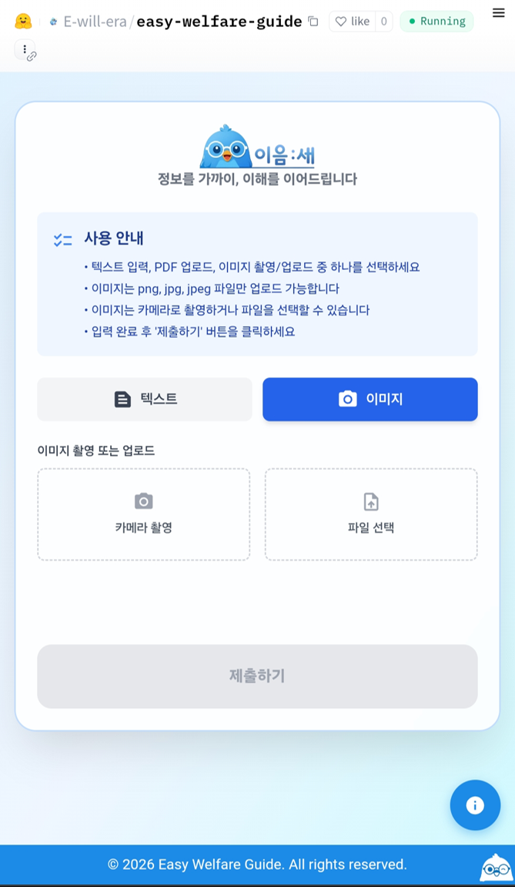
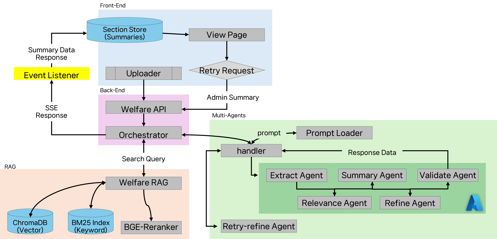
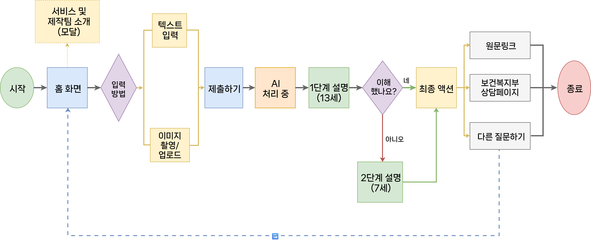
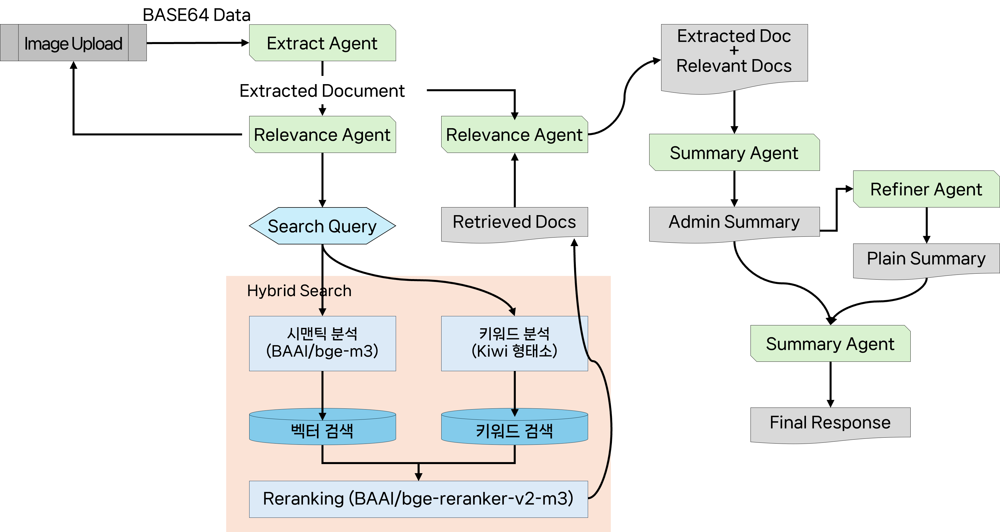

#   이음:새 (Connecting Bridge)

> **이**해가 안될 때  
> **음**, 이게 뭘까 싶을 때  
> **새**롭게 알려드리는  
> 
> AI 기반 복지 공고 쉬운말 도우미

## 📌 프로젝트 소개

**이음:새**는 복잡하고 어려운 복지 관련 공지문을 AI 기술로 간소화하는 서비스입니다. 

### 왜 만들었나요?

- 복지 혜택 정보는 많지만, 어려운 용어와 복잡한 문장으로 이해하기 어려워요
- 정보 접근성이 낮아 실제로 도움이 필요한 사람들이 혜택을 놓치는 경우가 많아요
- 누구나 쉽게 이해할 수 있는 언어로 복지 정보를 전달하고자 합니다

### 주요 타겟

- 1차: 정보를 이해할 여력이 없는 **20-30대 청년**
- 2차: 디지털 정보 접근에 어려움을 겪는 **취약계층**

## ✨ 주요 기능

### 1. 2단계 난이도 변환
- **레벨 1**: 13세 수준의 읽기 난이도로 변환
- **레벨 2**: 7세 수준의 읽기 난이도로 변환
- 사용자가 자신에게 맞는 난이도를 선택할 수 있습니다

### 2. 문서 처리
- 복지 공지문 업로드 및 자동 분석
- 이미지 형태의 공지도 처리 가능 (GPT-4o-mini Vision API 활용)

### 3. 쉬운 안내
- 복잡한 조건과 절차를 단계별로 명확하게 안내
- 어려운 행정 용어를 일상 언어로 변환

## 📱 서비스 화면

### 데스크톱 웹
<p align="center">
  
</p>

### 모바일 웹
<p align="center">
  
</p>

### 데모 영상
📹 [YouTube에서 데모 영상 보기 (Shorts)](https://youtube.com/shorts/KfCIdV4QthY?feature=share)

사용자가 복지 공지를 업로드하고, 쉬운 버전으로 변환하는 전체 과정을 영상으로 확인하실 수 있습니다.

## 🏗 시스템 아키텍처

### 전체 시스템 구조


이음:새는 **Multi-Agent AI 시스템**과 **RAG(Retrieval-Augmented Generation)** 기술을 기반으로 구성되어 있습니다.

#### 주요 컴포넌트
- **Frontend (View Page)**: 사용자 인터페이스 및 문서 업로드
- **Backend (Welfare API & Orchestrator)**: API 서버 및 요청 조정
- **Multi-Agent System**: 
  - Extract Agent: 문서 정보 추출
  - Summary Agent: 내용 요약
  - Validate Agent: 정확성 검증
  - Relevance Agent: 관련성 평가
  - Refine Agent: 최종 다듬기
- **Welfare RAG**: ChromaDB(Vector) + BM25 Index(Keyword) 하이브리드 검색
- **BGE-Reranker**: 검색 결과 재순위화로 정확도 향상

### 서비스 플로우


사용자가 복지 공지문을 업로드하면, AI가 자동으로 분석하여 2단계 난이도(13세/7세 수준)로 변환합니다. 사용자는 이해하기 쉬운 버전과 원문 링크, 상세 정보를 함께 확인할 수 있습니다.

### RAG 검색 워크플로우


#### Hybrid Search 전략
1. **시맨틱 분석**: BAAI/bge-m3 모델로 의미 기반 벡터 검색
2. **키워드 분석**: Kiwi 형태소 분석기로 정확한 키워드 매칭
3. **Reranking**: BAAI/bge-reranker-v2-m3로 최종 결과 정렬

이 3단계 프로세스를 통해 정확하고 관련성 높은 복지 정보를 제공합니다.

## 🛠 기술 스택

### Backend

| 분류 | 기술 | 버전 | 용도 및 역할 |
|------|------|------|-------------|
| **Core Framework** | FastAPI | >=0.109.0 | 고성능 비동기 웹 프레임워크 (API 서버 구축) |
| | Uvicorn | >=0.27.0 | 비동기 호출을 위한 ASGI 서버 |
| **AI Interface** | OpenAI | 2.15.0 | LLM(GPT 시리즈) 모델 연동 및 API 통신 |
| | HTTPX | 0.28.1 | 비동기 HTTP 요청 처리 (API 통신 최적화) |
| | LangChain | >=0.3.0 | LLM 오케스트레이션 및 파이프라인 관리 |
| **Data Validation** | Pydantic | 2.12.5 | 데이터 모델 정의 및 자동 유효성 검사 |
| | Pydantic-settings | 2.12.0 | 환경 변수 및 설정 관리 자동화 |
| **Environment** | Python-dotenv | 1.2.1 | `.env` 파일 로드 및 환경 설정 관리 |
| | PyYAML | 6.0.3 | YAML 형식의 설정 파일 파싱 |
| **Utilities** | Aiofiles | 25.1.0 | 비동기 파일 입출력(I/O) 처리 |
| | Python-multipart | >=0.0.6 | HTTP 요청 시 폼 데이터 및 파일 업로드 처리 |
| **Vector DB** | ChromaDB | >=0.5.0 | RAG 구현을 위한 벡터 데이터 저장 |
| **NLP Engine** | Kiwipiepy | >=0.17.0 | 한국어 형태소 분석 및 텍스트 전처리 |
| **Model Ops** | Transformers | 4.40.0 | 로컬 임베딩 및 딥러닝 모델 연산 지원 |
| | Torch | 2.2.0 | 딥러닝 모델 연산 지원 |

### Frontend

#### Core Framework

| 기술 | 버전 | 용도 |
|------|------|------|
| React | 19.2.3 | UI 라이브러리 |
| React DOM | 19.2.3 | React DOM 렌더링 |
| React Scripts | 5.0.1 | CRA (Create React App) 빌드 도구 |

#### UI Framework & Styling

| 기술 | 버전 | 용도 |
|------|------|------|
| MUI Material | 7.3.7 | UI 컴포넌트 라이브러리 |
| MUI Icons Material | 7.3.7 | 아이콘 라이브러리 |
| Emotion React | 11.14.0 | CSS-in-JS (MUI 의존성) |
| Emotion Styled | 11.14.1 | Styled Components 스타일 CSS-in-JS |
| Tailwind CSS | 3.4.1 | 유틸리티 기반 CSS 프레임워크 |
| PostCSS | 8.5.6 | CSS 후처리기 |
| Autoprefixer | 10.4.23 | CSS 벤더 접두사 자동 추가 |

#### 데이터 저장

| 기술 | 버전 | 용도 |
|------|------|------|
| idb-keyval | 6.2.2 | IndexedDB 간편 API |

#### 테스팅

| 기술 | 버전 | 용도 |
|------|------|------|
| Testing Library React | 16.3.2 | React 컴포넌트 테스팅 |
| Testing Library DOM | 10.4.1 | DOM 테스팅 유틸리티 |
| Testing Library Jest DOM | 6.9.1 | Jest DOM 매처 확장 |
| Testing Library User Event | 13.5.0 | 사용자 이벤트 시뮬레이션 |
| Web Vitals | 2.1.4 | 성능 측정 |

### 아키텍처
- **RAG (Retrieval-Augmented Generation)**: 정확한 정보 검색 및 생성
- **Multi-Agent AI System**: 복잡한 작업을 단계별로 처리
- 맞춤형 프롬프트 엔지니어링으로 최적화된 변환 품질

## 🚀 시작하기

### 사전 요구사항
```
Python 3.8 이상
Node.js 14 이상
```

### 설치 방법

1. 저장소 클론
```bash
git clone https://github.com/your-team/connecting-bridge.git
cd connecting-bridge
```

2. Backend 설정
```bash
cd backend
pip install -r requirements.txt
```

3. Frontend 설정
```bash
cd frontend
npm install
```

4. 환경 변수 설정
`.env` 파일을 생성하고 필요한 API 키를 설정합니다
```
OPENAI_API_KEY=your_api_key_here
```

### 실행 방법

1. Backend 서버 실행
```bash
cd backend
uvicorn main:app --reload
```

2. Frontend 서버 실행
```bash
cd frontend
npm start
```

3. 브라우저에서 `http://localhost:3000` 접속

## 👥 팀 구성

| 이름 | 역할 | 담당 업무 |
|------|------|----------|
| **윤여은** | PM (Team Lead) | • 서비스 로드맵 설계<br>• 일정 관리<br>• 전체 기획 총괄 |
| **김현식** | Backend (Part Lead) | • Vector DB 구축<br>• RAG 플로우 설계 |
| **김은선** | Backend | • 비동기 AI Pipeline 설계<br>• 프롬프트 엔지니어링<br>• API/Agent/로직 구현 |
| **박나은** | Frontend (Part Lead) | • 데이터 수집<br>• 하이브리드 상태관리<br>• 배포 |
| **김문정** | Frontend | • UI/UX 디자인<br>• 프론트엔드 서브 |

## 🚀 배포

이 프로젝트는 **Hugging Face Spaces**에 배포되었습니다.

- 배포 플랫폼: Hugging Face Spaces
- 2개의 Hugging Face 토큰을 활용한 배포 경험
- FastAPI + React 풀스택 애플리케이션 배포 및 운영

## 📄 라이선스

SeSAC Microsoft AI 시스템 엔지니어 3기 프로젝트로, 교육 목적으로 개발되었습니다.
