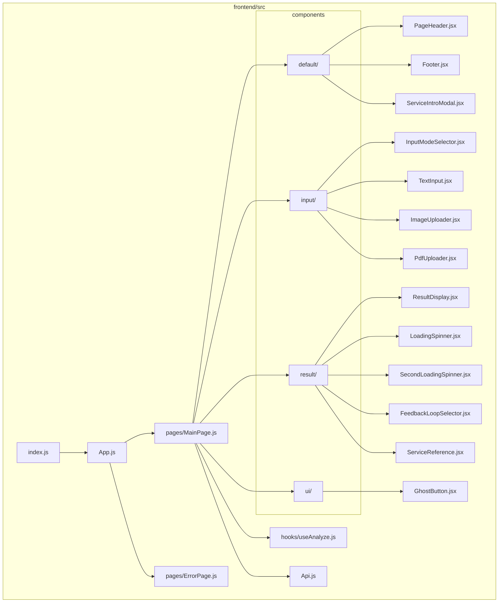
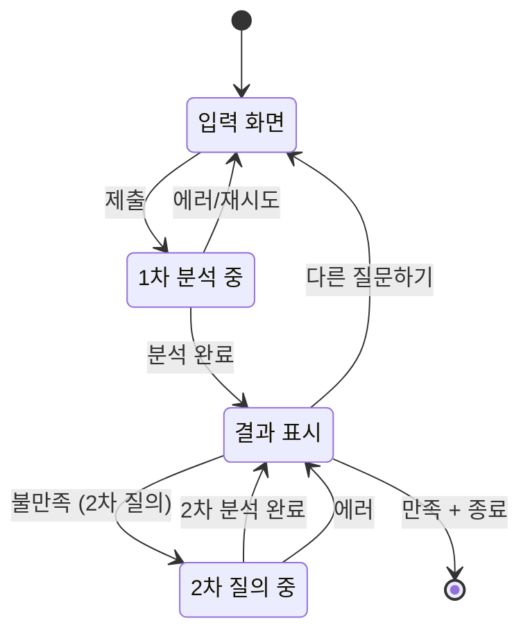
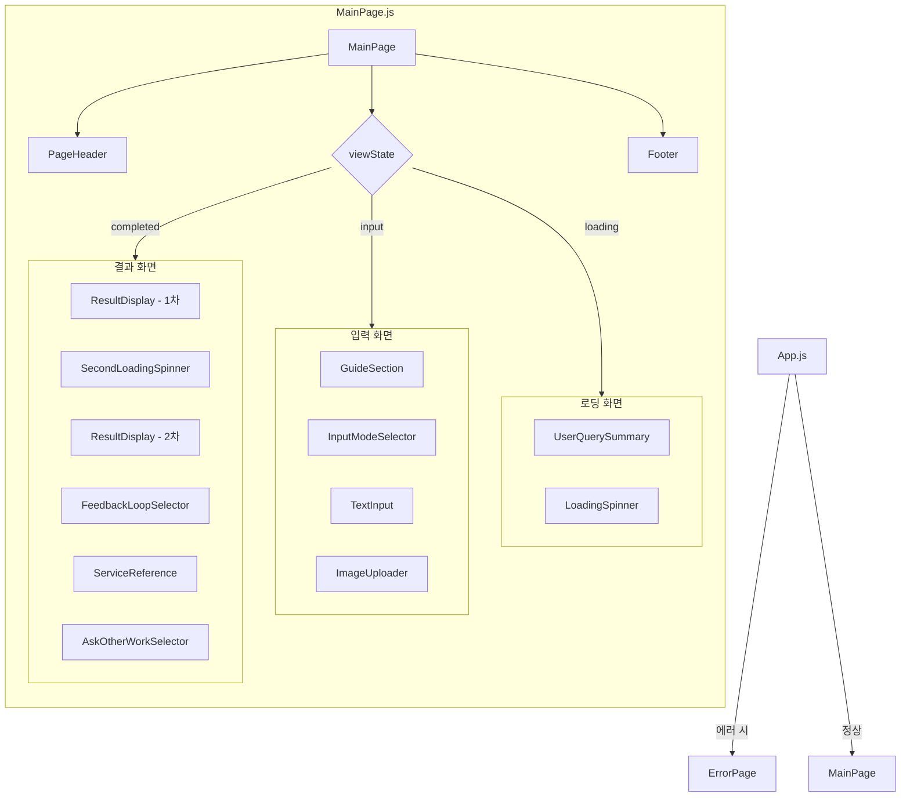
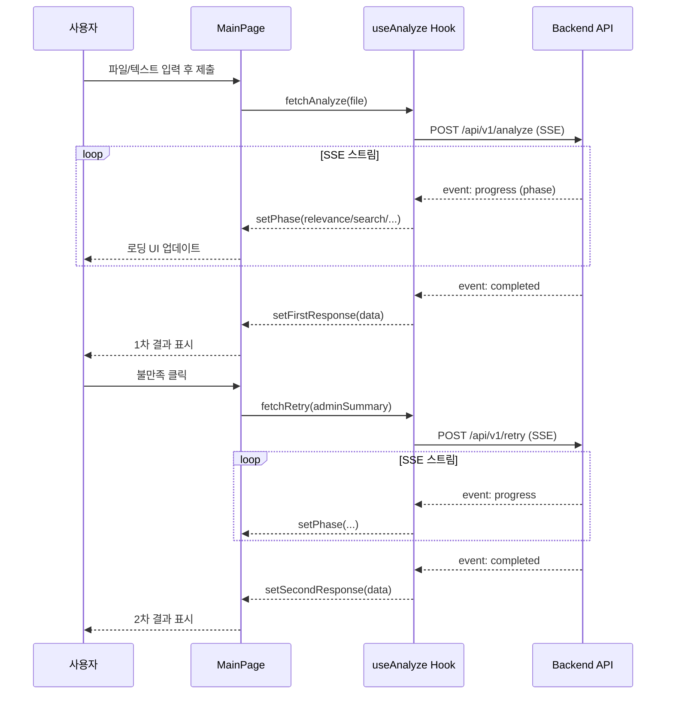
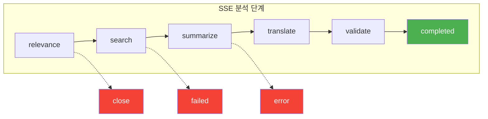
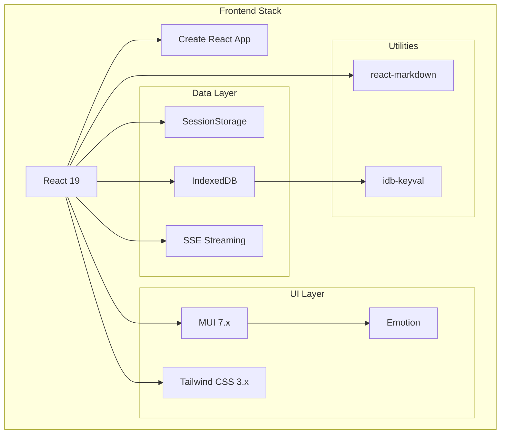
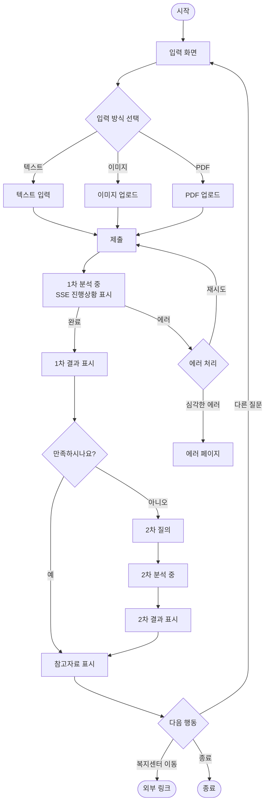

# 프론트엔드 아키텍처

## 1. 디렉토리 구조

---

## 2. 상태 흐름 (State Flow)

---

## 3. 컴포넌트 계층 구조

---

## 4. 데이터 흐름 (SSE 통신)

---

## 5. SSE Phase 진행 상태

---

## 6. 기술 스택 다이어그램

---

## 7. 사용자 여정 (User Flow)

